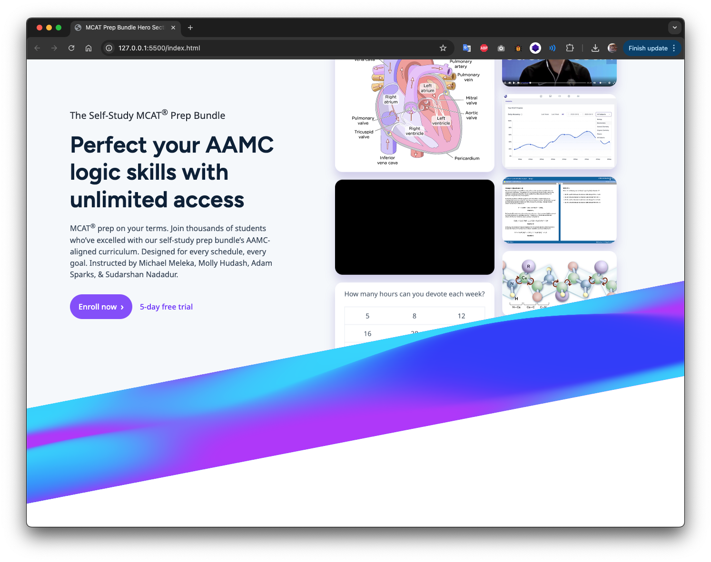

# Simple HTML Challenge

This is a basic HTML project created as a simple challenge to practice and demonstrate fundamental HTML skills. The goal is to build a structured and semantic webpage using only HTML.



## Features

- Semantic HTML structure
- Use of standard HTML tags (headings, paragraphs, lists, links, etc.)
- No Auxiliary JavaScript libraries other than the one in the challenge instruction with pure HTML/CSS

## Files

- `index.html`: Main HTML file containing the webpage content

## Getting Started

To view the page:

1. Clone this repository:
   ```bash
   git clone https://github.com/ifarshgar/Simple-HTML-Challenge.git
   ```
2. Open the `index.html` file in your browser:
   ```bash
   open index.html
   ```
   Or simply double-click the file in your file explorer.

   if you are using Mac, you may have to use a python live server to open the project:
   ```python
   python3 -m http.server 8000
   ```
   And then on your browser use localhost:8000 to see the project.

## Purpose

This project is intended for:

- Practicing basic HTML skills
- Learning the importance of semantic markup
- Serving as a reference for beginners in web development

## License

This project is licensed under the [MIT License](LICENSE).
